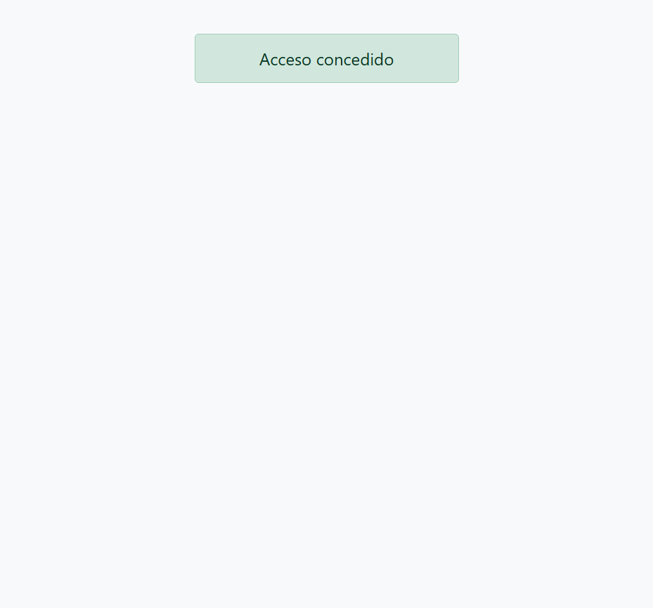

# Construcción de Escenarios Gherkin en Proyecto Automatizado con Java + Cucumber

## Módulo 5 - Sesión 2 - Actividad 2

## Equipo 4: 
- Eduardo Arellano
- Fabiola Díaz
- Felipe Lobos
- Carlos Vasquez

## Datos de trabajo

https://bco-selenium.netlify.app/
usuario "demoUser" y clave "demoPass"

